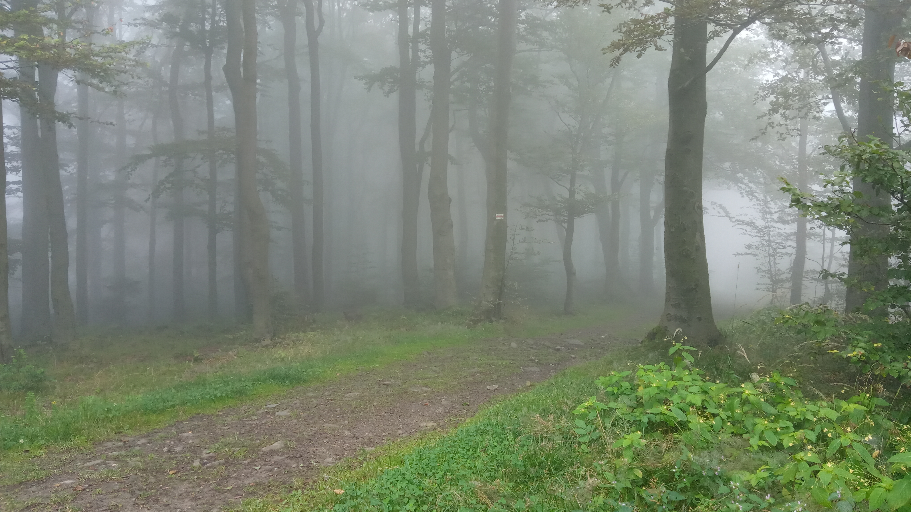
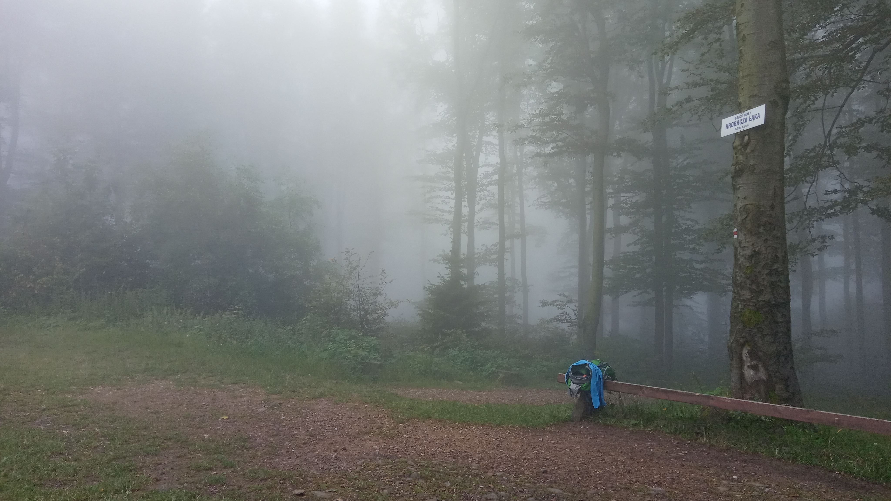
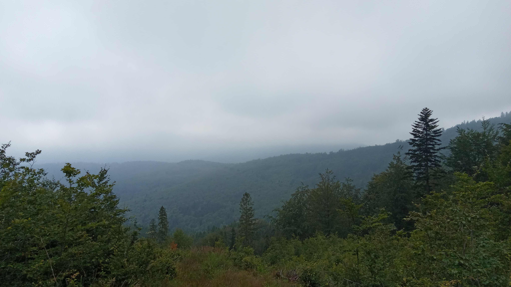
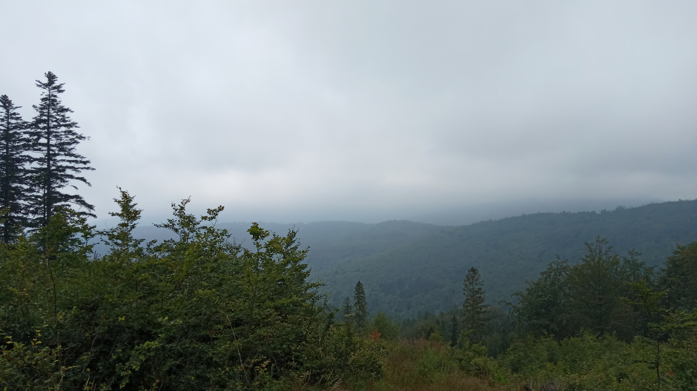

<iframe src="https://mapa-turystyczna.pl/map/widget/track/h1l0p1/148422a3.html" height="680" frameborder="0" style="width:100%;border:0;"></iframe><a href="https://mapa-turystyczna.pl/track/148422a3?utm_source=external_web&amp;utm_medium=widget&amp;utm_campaign=track_widget" target="_blank" style="color:#999;padding:7px 0;font-size: 13px;font-family:Roboto,Arial,sans-serif;display: inline-block;">Nagrana trasa: Hrobacza Łąka | mapa-turystyczna.pl</a>

