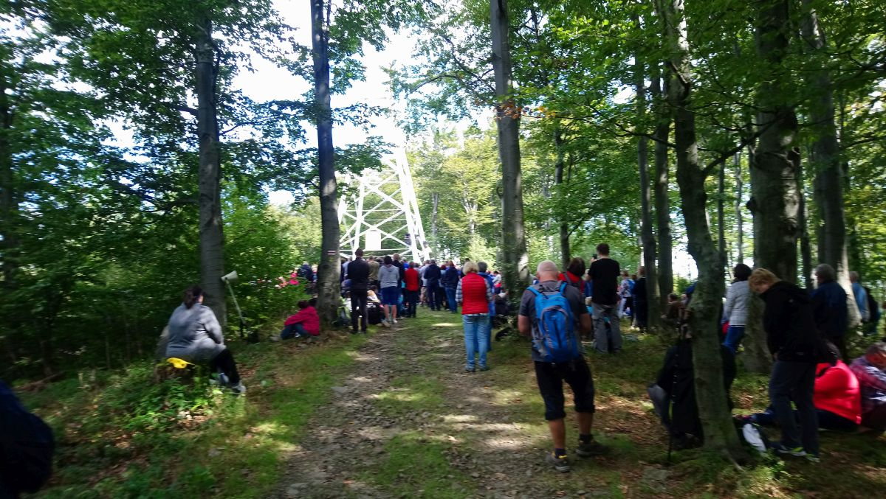
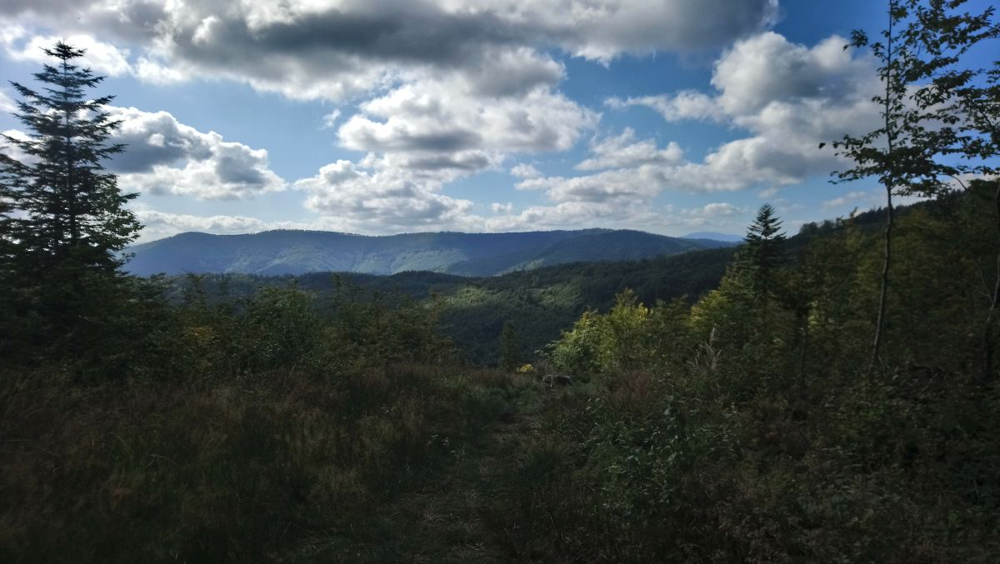
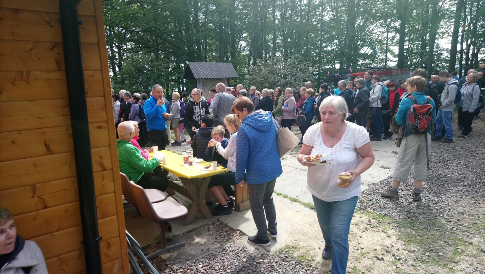

Dzisiaj zdobyliśmy szczyt Hrobaczej Łąki. Przy pięknej pogodzie udaliśmy się rano na szlak. Po wyjściu na górę uczestniczyliśmy we Mszy Św. czuwając pod Krzyżem na szczycie Hrobaczej Łąki. Po modlitwie ku naszemu zaskoczeniu zostaliśmy poczęstowani pyszną grochówką oraz ciastem. Zeszliśmy około godz. 15.00.

