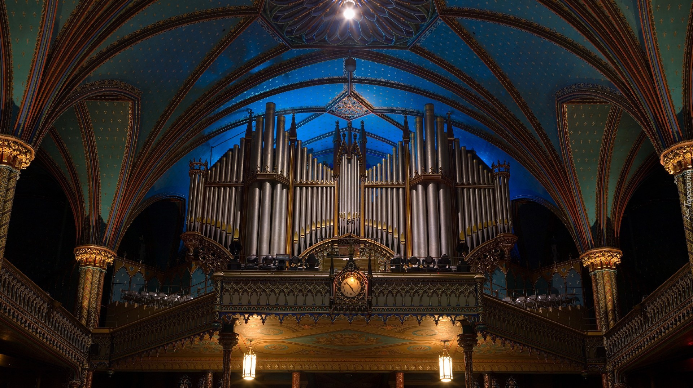

Muzyka to kolejna moja pasja. Lubię różne gatunki muzyczne, w szczególności jazz i muzykę klasyczną. Dziś wybrałem się na koncert muzyki organowej
oraz skrzypcowej do Kościoła pw. Św. Jana Chrzciciela w Bielsku - Białej Komorowicach.

Program:

<li>S. Karg-Elert – Marsz tryumfalny „Nun danket alle Gott”</li>
<li>J. Svendsen – Romance G-dur *</li>
<li>J. S.Bach – Passacaglia c-moll</li>
<li>I. Strawiński – Suite italienne cz. 1 Introduzione i cz. 2 Serenata *</li>
<li>J. S. Bach / A. Vivaldi – Koncert a-moll cz. I</li>
<li>K. Lipiński – II Koncert skrzypcowy D-dur cz. II *</li>
<li>A. Guilmant – Marsz nt. Haendla „Lift up your heands”</li>
* utwory na skrzypce i organy

Piękne utwory, szczególnie zabrzmiała Passacaglia c-moll J. S. Bacha.

Utwór na bis: Jules Massenet - Meditation from Thais na organy i skrzypce.

Wykonawcy:
Karol Lipiński - Brańka - skrzypce,
Tadeusz Barylski - organy.
