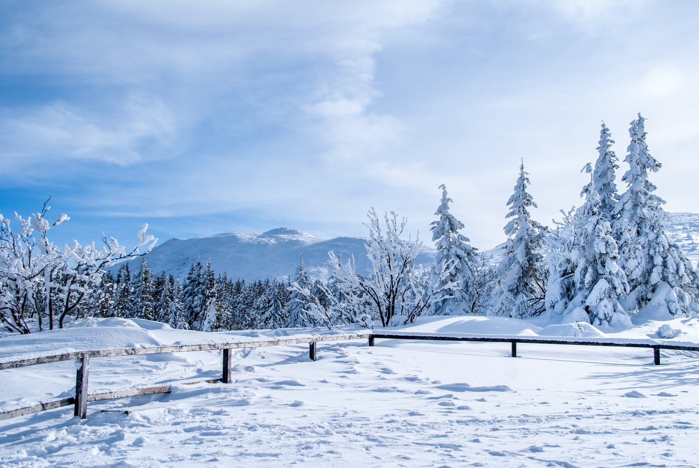

Jak na mieszkańca Beskidu Małego przystało postanowiłem zaprezentować Koronę Beskidów czyli 9 najwższych szczytów poszczególnych pasm Beskidów.</p?>
<b>Kolorem niebieskim oznaczyłem zdobyte szczyty.</b>
<b>
<ul>
<li>Babia Góra 1725 Beskid Żywiecki</li>
<li class="blue">Czupel 933 Beskid Mały</li>
<li>Lackowa 997 Beskid Niski</li>
<li class='blue'>Lubomir 904 Beskid Makowski</li>
<li class='blue'>Mogielica 1171 Beskid Wyspowy</li>
<li>Radziejowa 1262 Beskid Sądecki</li>
<li class='blue'>Skrzyczne 1257 Beskid Śląski</li>
<li>Tarnica 1346 Bieszczady</li>
<li class='blue'>Turbacz 1310 Gorce</li>
</ul>
</b>
