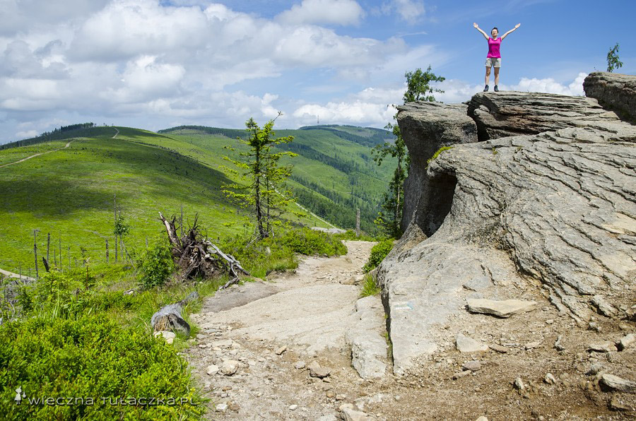

<iframe src="https://mapa-turystyczna.pl/map/widget/route/h1l0p1/tgo6.html" height="680" frameborder="0" style="width:100%;border:0;"></iframe><a href="https://mapa-turystyczna.pl/route/tgo6?utm_source=external_web&amp;utm_medium=widget&amp;utm_campaign=route_widget" target="_blank" style="color:#999;padding:7px 0;font-size: 13px;font-family:Roboto,Arial,sans-serif;display: inline-block;">Trasa: Lipowa, Ostre – Lipowa, Ostre | mapa-turystyczna.pl</a>

