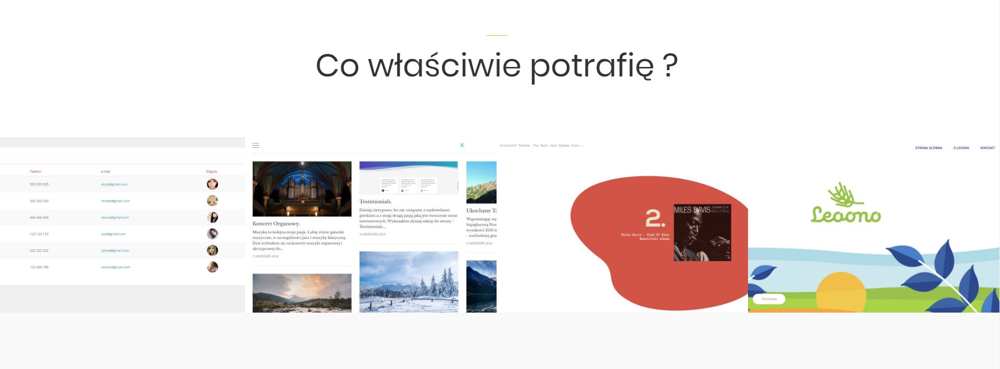

Dzisiaj pracuję nad sekcją moje portfolio na stronie <a href="http://krzysztofplonka.pl">http://krzysztofplonka.pl</a> Zamieszczam w nim cztery projekty:

1. Phonebook. <a href="http://phone.krzysztofplonka.pl">http://phone.krzysztofplonka.pl</a> Login i hasło podaję po wysłaniu do mnie maila :) 
Tutaj wykonałem zarówno back-end (Silex) jak i front-end (Angular.js). 
2. Mój blog <a href="http://blog.krzysztofplonka.pl">http://blog.krzysztofplonka.pl</a> 
3. Moje ulubione płyty jazzowe. <a href="http://jazz.krzysztofplonka.pl">http://jazz.krzysztofplonka.pl</a> 
4. Strona na zlecenie: Leoono - zdrowe płatki.<a href="https://leoono.pl"> https://leoono.pl</a> wykonana z Magdaleną Cieślik.

