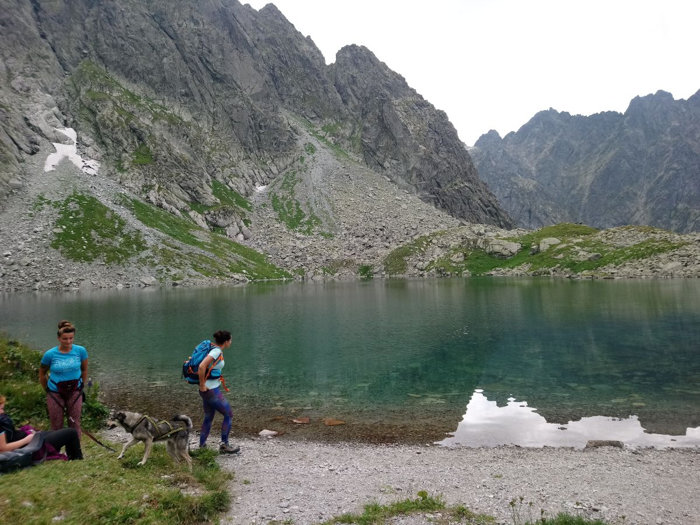
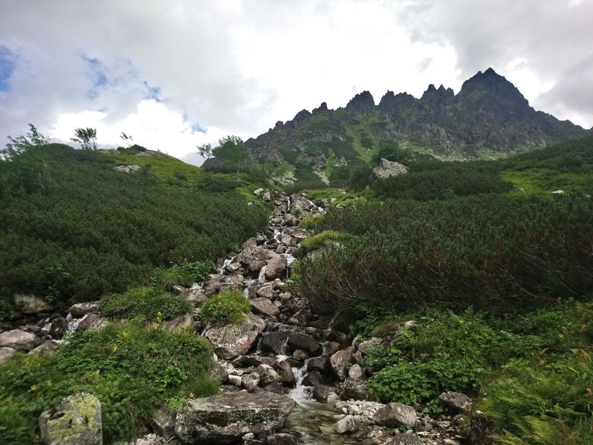

Dnia 10.08.2019 wyruszyliśmy na wędrówkę z PTT Bielsko - Biała na Polski Grzebień w Wysokich Tatrach  Słowackich. Trasa do Łysej Polany przez Śląski Dom wynosi 30km.

Poniżej fotorelacja z wyprawy.

