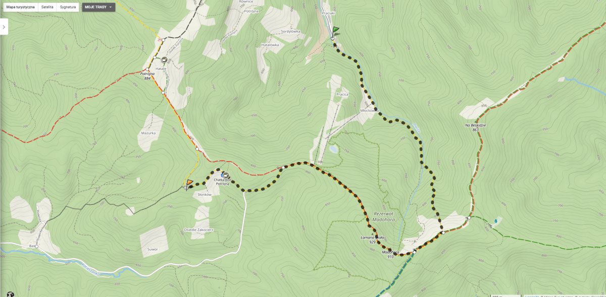

Dnia 01.09.2019 udaję się  na zwiedzanie rezerwatu Madohora w Beskidzie Małym. Wyjście rozpoczynam żółtym szlakiem z Rzyk Praciaki.
Moim celem jest dotarcie do skały - Zbójeckie okno. Trasa wynosi ok. 12km. Fotorelacja już w najbliższą niedzielę.

