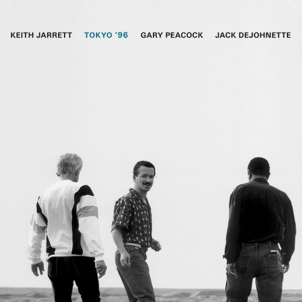

Natrafiłem dzisiaj na znakomity album jazzowy tria Keith Jarrett, Gary Peacock, Jack DeJohnette - Tokyo '96. Dla fanów jazzu na jesienne popołudnia...

Z płyt Keitha Jarretta polecam wszystko, a mistrzostwem jest dla mnie czteropłytowy album solowy A Multitude Of Angels z 2016 roku, na którym zarejestrowane są koncerty w czterech miastach: Modenie, Ferrarze, Turynie i Genui.

