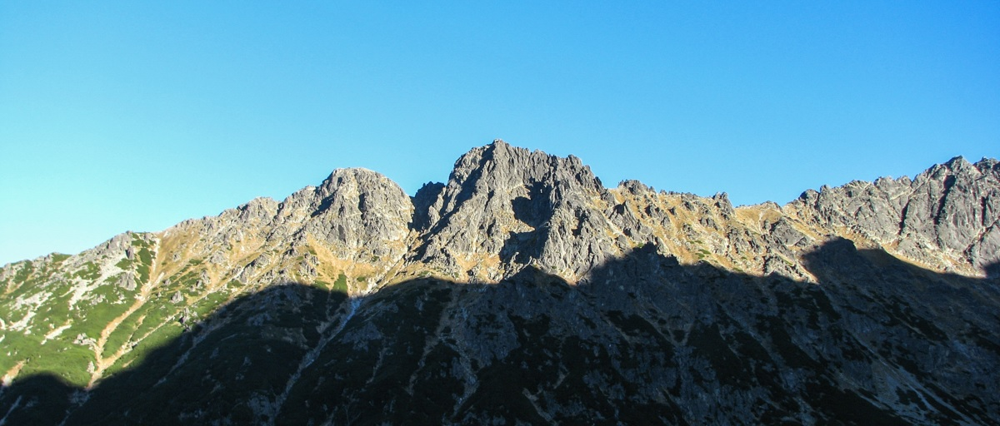

Wspominając wędrówki tatrzańskie, muszę wymienić Szpiglasową Przełęcz, przepiękną, położoną na wysokości 2110 m n.p.m. na początku długiej północno - wschodniej grani Szpiglasowego Wierchu 2172 m n.p.m.
Na szczyt Szpiglasowego Wierchu nie wychodziłem, ale trasa przez Przełęcz z Morskiego Oka do Doliny Pięciu Stawów Polskich jest niesamowita, polecam do przejścia. Oczywiście łańcuchy jako pomoc są.

